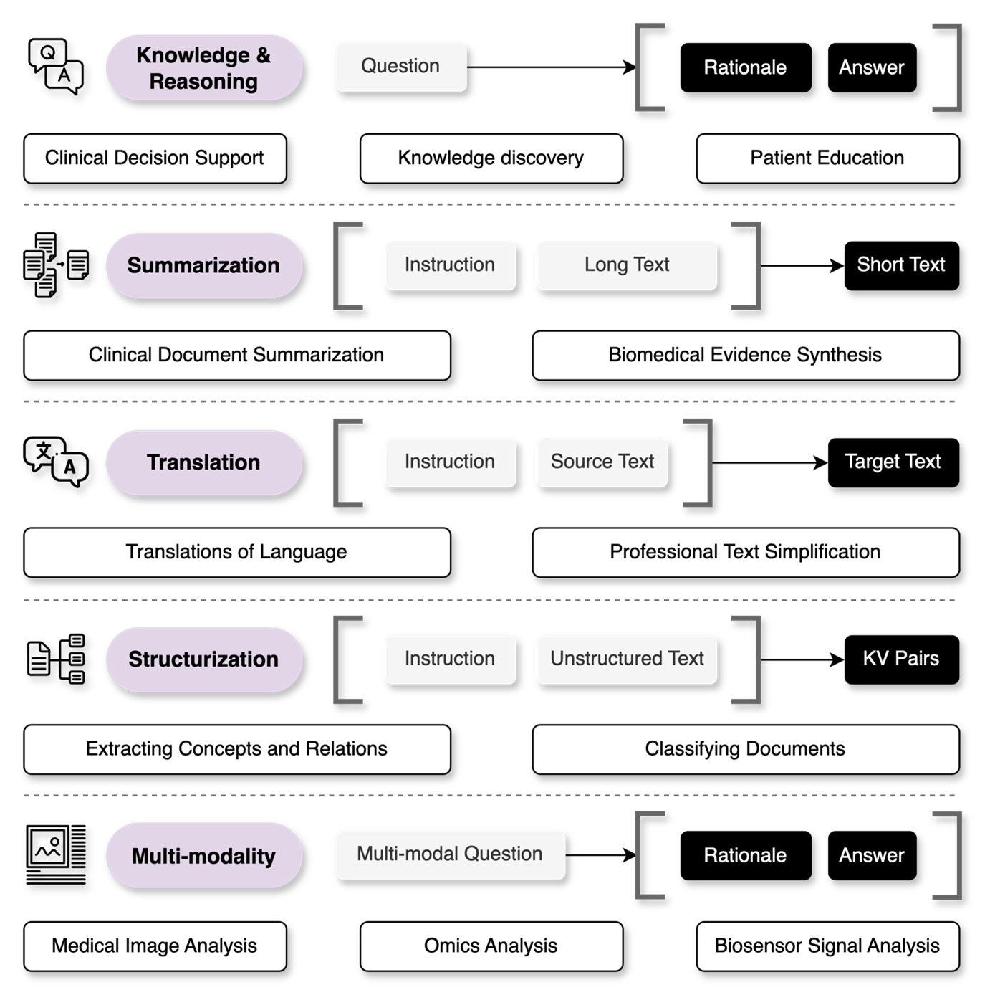
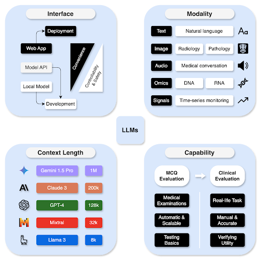
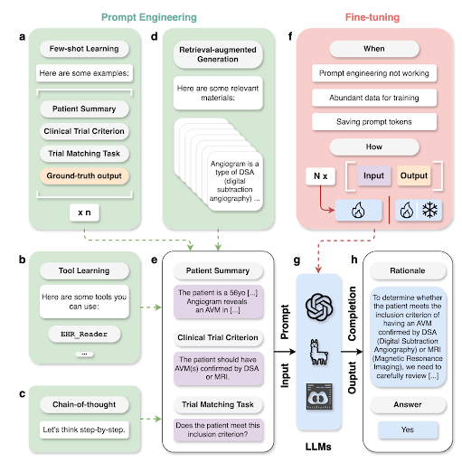

# LLM-Medicine-Tutorial-Internal

## Introduction
This tutorial is an extension of concepts and recommendations outlined in the paper "A Systematic Approach to Utilizing Large Language Models in Medicine". Large language models (LLMs) represent a transformative class of artificial intelligence (AI) tools that can be used for a variety of tasks. Here, we provide example scripts related to a relevant healthcare task - clinical trial matching - and demonstrate important concepts including temperature, chain-of-thought prompting, few-shot learning, retrieval-augmented generation (RAG), and data preparation for fine-tuning.


**Figure 1.** Overview of the proposed systematic approach to utilizing large language models in medicine.

## Formulating the task
When defining a medical need that may be addressed by an LLM, a user must first understand the core capabilities of LLMs. We classify LLM capabilities into five broad categories: structurization, summarization, translation, knowledge & reasoning, and multi-modal data processing.



**Figure 2.** An overview of five common task formulations enabled by LLMs in medicine.

## Choosing a large language model
Users should choose an appropriate LLM based on the task characteristics. We categorize these characteristics into four main categories: model interface, data modality, context length, and medical capability.



**Figure 3.** Considerations for choosing an LLM.

A diversity of LLMs have been evaluated for their medical capability. Below, we summarize several popular LLMs.

**Table 1.** Characteristics of different LLMs, sorted by the best reported MedQA-USMLE (4 options) score. T: text; I: image; V: video; A: audio.

| LLM        | Availability | Size         | Interface     | Modality     | Context        | MedQA       |
|------------|--------------|--------------|---------------|--------------|----------------|-------------|
| Gemini 1.5 | Closed       | NA           | Web, API      | T, I, V, A   | 1M, 2M         | 91.1%       |
| GPT-4      | Closed       | NA           | Web, API      | T, I         | 8k, 32k, 128k  | 90.2%       |
| Llama 3    | Open         | 8B, 70B, 405B| API, Local    | T            | 8k             | 80.9%       |
| GPT-3.5    | Closed       | NA           | Web, API      | T            | 4k, 16k        | 68.7%       |
| Gemini 1.0 | Closed       | NA           | Web, API      | T, I, V      | 32k            | 67.0%       |
| Mixtral    | Open         | 8x7B         | API, Local    | T            | 32k            | 64.1%       |
| Mistral    | Open         | 7B           | API, Local    | T            | 8k, 32k        | 59.6%       |
| Llama 2    | Open         | 7B, 70B      | API, Local    | T            | 4k             | 47.8%       |
| Claude 3   | Closed       | NA           | Web, API      | T, I         | 200k           | N/A         |

## Prompt engineering
Once a user has formulated a task and selected an appropriate LLM, they must carefully consider the prompt (input content) given to the model. Additionally, users may consider implementing fine-tuning techniques to improve the performance of their model.



**Figure 4.** An overview of prompt engineering and fine-tuning techniques.

Many techniques have been used within prompt engineering. Common methods includes few-shot learning, tool learning, chain-of-thought prompting, retrieval-augmented generation, and fine tuning.

**Table 2.** Characteristics of different methods to use LLMs.

| Method                      | Requirements                        | Pros                                                              | Cons                                       | Examples                               |
|-----------------------------|--------------------------------------|-------------------------------------------------------------------|--------------------------------------------|----------------------------------------|
| Few-shot learning            | Several exemplars                   | - Dealing with edge cases<br/>- Specifying expected styles         | Exemplars might introduce biases           | MedPrompt                             |
| Tool learning                | Application programming interfaces  | Providing domain functionalities                                  | Relies on the curation of tools            | GeneGPT, EHRAgent, ChemCrow            |
| Chain-of-thought prompting   | Additional prompt text              | - Providing explanations<br/>- Improving performance              | Hard for parsing (mitigated by structured output) | MedPrompt                             |
| Retrieval-augmented generation | A knowledge base or document collection | - Providing up-to-date knowledge<br/>- Reducing hallucinations     | Depends on the quality of the retrieved content | Almanac, MedRAG                       |
| Fine-tuning                  | Data annotations and compute        | - Improving performance<br/>- Shorten the prompt                  | Costly and resource-intensive              | MEDITRON, PMC-LLaMA, DRG-LLaMA        |

## Case studies

Before exploring the example scripts, we also suggest reviewing the following studies which leverage large language models for various healthcare tasks.

**Table 3.** Representative case studies of utilizing large language models in medicine.

| Study            | Task              | LLM(s)                                                                                  | Technique                                  | Evaluation                                                                 |
|------------------|-------------------|-----------------------------------------------------------------------------------------|--------------------------------------------|----------------------------------------------------------------------------|
| Van Veen et al.  | Summarization      | FLAN-T5, FLAN-UL2, Alpaca, Med-Alpaca, Vicuna, Llama-2, GPT-3.5, GPT-4                   | Few-shot learning, fine-tuning             | Quantitative metrics for summarization; Manual evaluation of clinical summarization                    |
| Singhal et al.   | Knowledge and Reasoning | PaLM, Flan-PaLM                                                               | Few-shot learning, chain-of-thought prompting, fine-tuning | Accuracy in MedMCQA, MedQA (USMLE), and PubMedQA; Manual evaluation of clinical questions and answers; Lay user assessment                             |
| Wang et al.      | Structurization    | Llama, ClinicalBERT                                                                     | Fine-tuning                                | Performance metrics for prediction of Diagnosis Related Groups; Manual analysis of prediction errors |
| Mirza et al.     | Translation        | GPT-4                                                                                   | Baseline prompting                         | Manual evaluation of clinical translation by clinicians and legal experts                                       |
| Zhang et al.     | Multi-modality     | BiomedGPT                              | Fine-tuning                                | Accuracy for image classification and vision QA; Quantitative metrics for summarization, text understanding, and image captioning           |

## Configuration
To execute this example code in a Google Colab environment or within your own terminal, one must first set up the OpenAI Application Programming Interface (API) either directly through OpenAI or through Microsoft Azure. Here we use Microsoft Azure because it is compliant with Health Insurance Portability and Accountability Act (HIPAA). Ensure that an appropriate PROJECT_HOME path has been set, and please set the enviroment variables accordingly:
```python
export OPENAI_ENDPOINT=YOUR_AZURE_OPENAI_ENDPOINT_URL
export OPENAI_API_KEY=YOUR_AZURE_OPENAI_API_KEY
```

## Tutorial Code
See the notebook below to learn about common openAI GPT model practices, API calling, tokenization, and prompt engineering.
https://colab.research.google.com/drive/1nk4wkWL0x4RQ6-ti2JWHYusnFEn-e16t?usp=sharing

