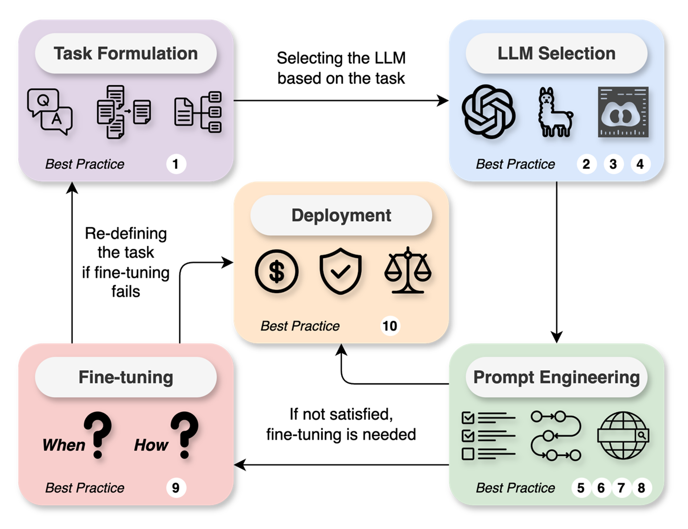

# LLM-Medicine-Tutorial-Internal

## Introduction
This tutorial is an extension of concepts and recommendations outlined in the paper "A Systematic Approach to Utilizing Large Language Models in Medicine". Large language models (LLMs) represent a transformative class of artificial intelligence (AI) tools that can be used for a variety of tasks such as structurization, summarization, translation, knowledge & reasoning, and multi-modal processing. Here, we provide example scripts related to a relevant healthcare task - clinical trial matching - and demonstrate important concepts including temperature, chain-of-thought prompting, few-shot learning, retrieval-augmented generation (RAG), and data preparation for fine-tuning.

<div style="background-color: white; padding: 10px; border-radius: 5px;">
    
</div>

Figure 1. Overview of the proposed systematic approach to utilizing large language models in medicine.

## Configuration
To execute this example code in a Google Colab environment or within your own terminal, one must first set up the OpenAI API either directly through OpenAI or through Microsoft Azure. Here we use Microsoft Azure because it is compliant with Health Insurance Portability and Accountability Act (HIPAA). Ensure that an appropriate PROJECT_HOME path has been set, and please set the enviroment variables accordingly:
```python
export OPENAI_ENDPOINT=YOUR_AZURE_OPENAI_ENDPOINT_URL
export OPENAI_API_KEY=YOUR_AZURE_OPENAI_API_KEY
```
