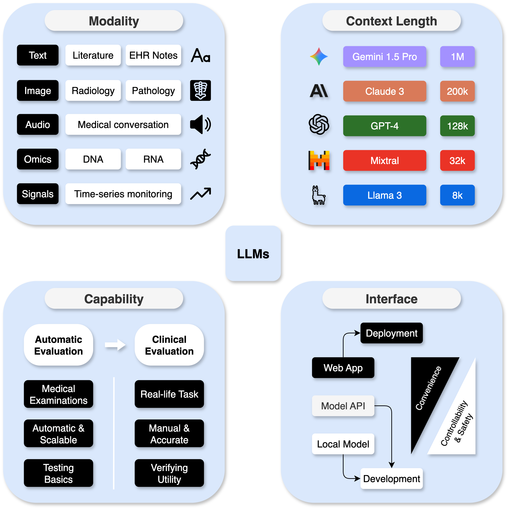

# Demystifying Large Language Models for Medicine: A Primer

## Introduction
This tutorial is an extension of concepts and best practices outlined in the paper "Demystifying Large Language Models for Medicine: A Primer". Large language models (LLMs) represent a transformative class of artificial intelligence (AI) tools that can be used for a variety of tasks. Here, we provide example scripts related to a relevant healthcare task - clinical trial matching - and demonstrate important concepts including tokenization, temperature, chain-of-thought prompting, few-shot learning, retrieval-augmented generation (RAG), and data preparation for fine-tuning.

<p align="center"></p>

**Figure 1.** Overview of the proposed systematic approach to utilizing large language models in medicine.

## Task formulation
When defining a medical need that may be addressed by an LLM, a user must first understand the core capabilities of LLMs. We classify LLM capabilities into five broad categories: structurization, summarization, translation, knowledge & reasoning, and multi-modal data processing.

<p align="center"></p>

**Figure 2.** An overview of five common task formulations enabled by LLMs in medicine.

## Choosing a large language model
Users should choose an appropriate LLM based on the task characteristics. We categorize these characteristics into four main categories: model interface, data modality, context length, and medical capability.

<p align="center"></p>

**Figure 3.** Considerations for choosing an LLM.

A diversity of LLMs have been evaluated for their medical capability. Below, we summarize several popular LLMs.

**Table 1.** Characteristics of different LLMs, sorted by the best reported MedQA-USMLE (4 options) score. T: text; I: image; V: video; A: audio.

| LLM        | Weights      | Size         | Interface     | Modality     | Context        | MedQA       |
|------------|--------------|--------------|---------------|--------------|----------------|-------------|
| Med-Gemini | Closed       | NA           | Web, API      | T, I, V, A   | 1M, 2M         | 91.1%       |
| GPT-4      | Closed       | NA           | Web, API      | T, I         | 8k, 32k, 128k  | 90.2%       |
| Med-PaLM 2 | Closed       | NA           | API           | T            | 8k             | 86.5%       |
| Llama 3    | Open         | 8B, 70B, 405B| API, Local    | T            | 8k             | 80.9%       |
| GPT-3.5    | Closed       | NA           | Web, API      | T            | 4k, 16k        | 68.7%       |
| Med-PaLM   | Closed       | 540B         | API           | T            | 8k             | 67.6%       |
| Gemini 1.0 | Closed       | NA           | Web, API      | T, I, V      | 32k            | 67.0%       |
| Mixtral    | Open         | 8x7B         | API, Local    | T            | 32k            | 64.1%       |
| Mistral    | Open         | 7B           | API, Local    | T            | 8k, 32k        | 59.6%       |
| Llama 2    | Open         | 7B, 70B      | API, Local    | T            | 4k             | 47.8%       |
| Claude 3   | Closed       | NA           | Web, API      | T, I         | 200k           | N/A         |

## Prompt engineering
Once a user has formulated a task and selected an appropriate LLM, they must carefully consider the prompt (input content) given to the model. Additionally, users may consider implementing fine-tuning techniques to improve the performance of their model.

<p align="center"></p>

**Figure 4.** An overview of prompt engineering and fine-tuning techniques.

Many techniques have been used within prompt engineering. Common methods includes few-shot learning, tool learning, chain-of-thought prompting, retrieval-augmented generation, and fine tuning.

**Table 2.** Characteristics of different methods to use LLMs.

| Method                      | Requirements                        | Pros                                                              | Cons                                       | Examples                               |
|-----------------------------|--------------------------------------|-------------------------------------------------------------------|--------------------------------------------|----------------------------------------|
| Few-shot learning            | Several exemplars                   | - Dealing with edge cases<br/>- Specifying expected styles         | Exemplars might introduce biases           | MedPrompt                             |
| Tool learning                | Application programming interfaces  | Providing domain functionalities                                  | Relies on the curation of tools            | GeneGPT, EHRAgent, ChemCrow            |
| Chain-of-thought prompting   | Additional prompt text ("Let's think step-by-step.")              | - Providing explanations<br/>- Improving performance              | Hard to parse (mitigated by structured output) | MedPrompt                             |
| Retrieval-augmented generation | A knowledge base or document collection | - Providing up-to-date knowledge<br/>- Reducing hallucinations     | Depends on the quality of the retrieved content | Almanac, MedRAG                       |
| Fine-tuning                  | Data annotations and compute        | - Improving performance<br/>- Shorten the prompt                  | Costly and resource-intensive              | MEDITRON, PMC-LLaMA, DRG-LLaMA        |

## Case studies

Before exploring the example scripts, we also suggest reviewing the following studies which leverage large language models for various healthcare tasks.

**Table 3.** Representative case studies of utilizing large language models in medicine.

| Study            | Task              | LLM(s)                                                                                  | Technique                                  | Evaluation                                                                 |
|------------------|-------------------|-----------------------------------------------------------------------------------------|--------------------------------------------|----------------------------------------------------------------------------|
| Van Veen et al.  | Summarization      | FLAN-T5, FLAN-UL2, Alpaca, Med-Alpaca, Vicuna, Llama-2                   | Few-shot learning, fine-tuning             | Automatic and manual evaluation of clinical summarization                    |
| Singhal et al.   | Knowledge and Reasoning | PaLM, Flan-PaLM                                                               | Few-shot learning, chain-of-thought prompting, fine-tuning | MCQ evaluation and manual evaluation of question answering                             |
| Wang et al.      | Structurization    | Llama, ClinicalBERT                                                                     | Fine-tuning                                | Automatic classification evaluation and manual error analysis |
| Mirza et al.     | Translation        | GPT-4                                                                                   | Baseline prompting                         | Manual evaluation of clinical translation by clinicians and legal experts                                       |
| Zhang et al.     | Multi-modality     | BiomedGPT                              | Fine-tuning                                | MCQ evaluation and manual evaluation of visual tasks           |

## Hands-on Tutorials

| Colab Link | Title | Content |
|-------|-------|-------------|
| <a href="https://colab.research.google.com/drive/1pfuCShbkF6LQwTcxjiZpilhgQ5L4XYJt?usp=sharing" target="_blank"></a> | LLM Basics | Tokenization, single-turn Prompting, multi-turn prompting, temperature |
| <a href="https://colab.research.google.com/drive/1fsAOLOn-zbLUVaNmI0NGfbn6t1-Otckw?usp=sharing" target="_blank"></a> | Chain-of-Thought | Loading and processing the trial matching dataset, direct prompting baseline, chain-of-thought prompting |
| <a href="https://colab.research.google.com/drive/1TqNaMV4uPEdDybWG11Z0KkXBiTIbZDCC?usp=sharing" target="_blank"></a> | Few-shot Learning | Loading and processing the trial matching dataset with few-shot demonstration selection, direct prompting baseline, few-shot prompting |
| <a href="https://colab.research.google.com/drive/1FGu2gZGQYTNPz_UT7KPMYCO5byWOUTFY?usp=sharing" target="_blank"></a> | RAG| Loading and processing the trial matching dataset, direct prompting baseline, retrieval-augmented generation with PubMed API |
| <a href="https://colab.research.google.com/drive/1oFJOWmW3M_49zYeRalqNP4jQtIXbQgla?usp=sharing" target="_blank"></a> | Fine-tuning | Loading and processing the trial matching dataset, preparing the data for fine-tuning GPT models |

## Acknowledgements
This work was supported by the Intramural Research Programs of the National Institutes of Health, National Library of Medicine.

## Disclaimer
This tutorial shows the results of research conducted in the Division of Intramural Research, NCBI/NLM. The information produced on this website is not intended for direct diagnostic use or medical decision-making without review and oversight by a clinical professional. Individuals should not change their health behavior solely on the basis of information produced on this website. NIH does not independently verify the validity or utility of the information produced by this tutorial. If you have questions about the information produced on this website, please see a health care professional. More information about NCBI's disclaimer policy is available.

## Citation
If you find our work useful, please cite it by:
```bibtex
@article{jin2024demystifying,
  title={Demystifying large language models for medicine: A primer},
  author={Jin, Qiao and Wan, Nicholas and Leaman, Robert and Tian, Shubo and Wang, Zhizheng and Yang, Yifan and Wang, Zifeng and Xiong, Guangzhi and Lai, Po-Ting and Zhu, Qingqing and others},
  journal={ArXiv},
  pages={arXiv--2410},
  year={2024}
}
```
